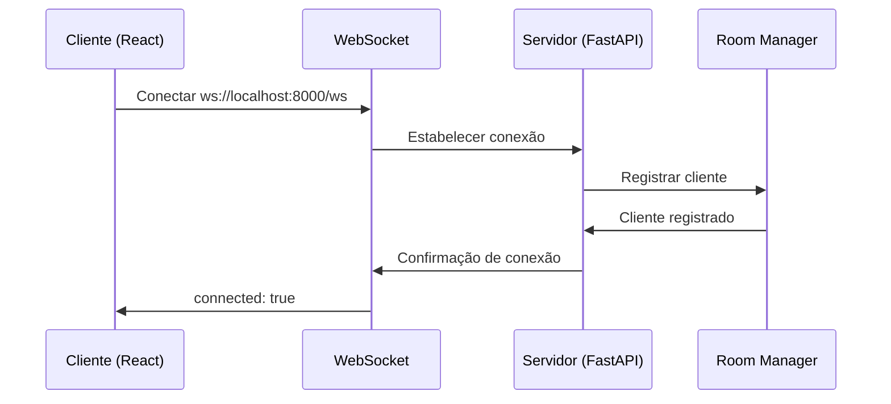
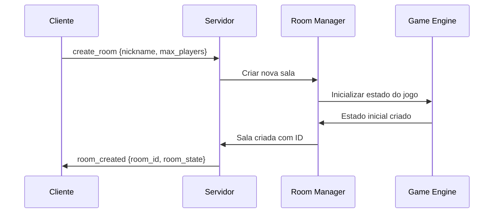
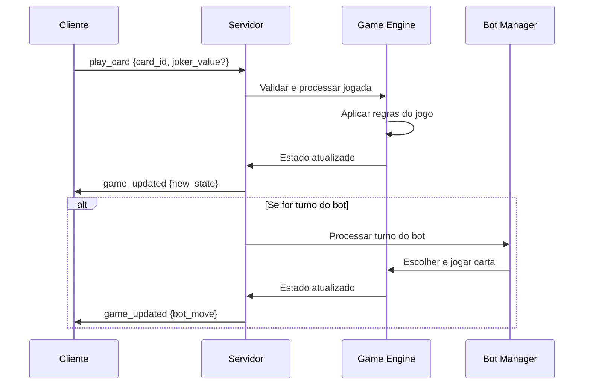

# SOMO: Network Blackout

Um jogo de cartas multiplayer online desenvolvido em Python (FastAPI) e React (TypeScript), jogável em tempo real através de WebSockets.


## 📋 Índice

- [Sobre o Jogo](#sobre-o-jogo)
- [Características Técnicas](#características-técnicas)
- [Pré-requisitos](#pré-requisitos)
- [Instalação e Configuração](#instalação-e-configuração)
- [Como Executar](#como-executar)
- [Como Jogar](#como-jogar)
- [Arquitetura do Sistema](#arquitetura-do-sistema)
- [API e WebSocket](#api-e-websocket)
- [Testes](#testes)
- [Desenvolvimento](#desenvolvimento)
- [Solução de Problemas](#solução-de-problemas)
- [Contribuição](#contribuição)
- [Licença](#licença)


## 🎮 Sobre o Jogo

SOMO: Network Blackout é um jogo de cartas estratégico multiplayer que combina elementos de sorte e habilidade. O objetivo é ser o último jogador a não ser eliminado, mantendo pelo menos um token de vida.

### Regras Básicas

O jogo funciona com um sistema de rodadas onde os jogadores devem jogar cartas sem exceder um limite aleatório estabelecido para cada rodada. Cada jogador começa com 3 tokens de vida e 7 cartas na mão.

**Mecânica Principal:**
- Cada rodada tem um limite aleatório entre 10 e 99
- Os jogadores jogam cartas em turnos, acumulando uma soma
- O objetivo é não exceder o limite da rodada
- Acertar o limite exato resulta em comprar +2 cartas
- Exceder o limite resulta em perder 1 token e todos comprarem +2 cartas
- Jogadores eliminados (0 tokens) não podem mais jogar
- O último jogador com tokens vence

**Tipos de Cartas:**
- **Números (0-9):** 6 cartas de cada valor, somam ao total
- **Joker:** 4 cartas, pode ser jogado como qualquer número 0-9
- **+2:** 7 cartas, próxima carta numérica recebe +2 ao valor
- **x2:** 6 cartas, próxima carta numérica tem valor multiplicado por 2
- **=0:** 7 cartas, zera imediatamente a soma acumulada
- **Reverse:** 6 cartas, inverte direção e pode devolver efeitos pendentes

### Características Especiais

O jogo implementa um sistema de efeitos pendentes sofisticado onde cartas especiais (+2, x2) afetam apenas a próxima carta numérica jogada. A carta Reverse não apenas inverte a direção do jogo, mas também pode devolver efeitos pendentes para quem os criou, adicionando uma camada estratégica profunda.

O sistema de bots oferece três níveis de dificuldade com estratégias distintas: bots fáceis jogam aleatoriamente, bots médios usam estratégias gananciosas priorizando cartas de menor valor, e bots difíceis adotam uma abordagem defensiva usando cartas especiais para controlar o jogo.


## 🚀 Características Técnicas

### Backend (Python)
- **FastAPI:** Framework web moderno e rápido para APIs
- **WebSockets:** Comunicação em tempo real entre clientes
- **Pydantic:** Validação de dados e serialização
- **Uvicorn:** Servidor ASGI de alta performance
- **Pytest:** Framework de testes unitários

### Frontend (React/TypeScript)
- **React 18:** Biblioteca de interface de usuário
- **TypeScript:** Tipagem estática para JavaScript
- **Vite:** Build tool rápido e moderno
- **Zustand:** Gerenciamento de estado leve e reativo
- **Tailwind CSS:** Framework CSS utilitário (via CDN)

### Arquitetura
- **Monorepo:** Estrutura organizada com backend e frontend separados
- **WebSocket Real-time:** Sincronização instantânea de estado entre jogadores
- **Engine de Jogo:** Lógica de negócio separada e testável
- **Sistema de Bots:** IA com múltiplos níveis de dificuldade
- **Gerenciamento de Salas:** Sistema automático de limpeza e organização

### Recursos Implementados
- ✅ Criação e entrada em salas de jogo
- ✅ Sistema de bots com 3 níveis de dificuldade
- ✅ Interface responsiva para desktop e mobile
- ✅ Chat em tempo real (implementado no backend)
- ✅ Notificações visuais de eventos do jogo
- ✅ Reconexão automática em caso de perda de conexão
- ✅ Validação completa de jogadas
- ✅ Sistema de turnos com indicação visual
- ✅ Efeitos especiais e animações CSS


## ⚙️ Pré-requisitos

Antes de executar o projeto, certifique-se de ter instalado:

### Software Necessário
- **Python 3.11+** - Linguagem de programação para o backend
- **Node.js 18+** - Runtime JavaScript para o frontend
- **npm ou yarn** - Gerenciador de pacotes para Node.js
- **pip** - Gerenciador de pacotes para Python

### Verificação da Instalação
```bash
# Verificar versões instaladas
python3 --version  # Deve ser 3.11+
node --version      # Deve ser 18+
npm --version       # Qualquer versão recente
pip3 --version      # Qualquer versão recente
```

## 📦 Instalação e Configuração

### 1. Clone o Repositório
```bash
git clone <url-do-repositorio>
cd somo
```

### 2. Configuração do Backend
```bash
# Navegar para o diretório do backend
cd backend

# Instalar dependências Python
pip3 install -r requirements.txt
```

**Dependências do Backend:**
- `fastapi==0.104.1` - Framework web
- `uvicorn==0.24.0` - Servidor ASGI
- `websockets==12.0` - Suporte a WebSockets
- `pydantic==2.5.0` - Validação de dados
- `python-multipart==0.0.6` - Suporte a formulários multipart
- `python-dotenv==1.1.1` - Carregamento de variáveis de ambiente

### 3. Configuração do Frontend
```bash
# Navegar para o diretório do frontend (a partir da raiz)
cd frontend

# Instalar dependências Node.js
npm install
```

**Dependências do Frontend:**
- `react==18.2.0` - Biblioteca de UI
- `react-dom==18.2.0` - Renderização DOM
- `zustand==4.4.1` - Gerenciamento de estado
- `typescript==5.0.2` - Tipagem estática
- `vite==4.4.5` - Build tool
- `@vitejs/plugin-react==4.0.3` - Plugin React para Vite

### 4. Configuração de Ambiente (Opcional)
Crie um arquivo `.env` no diretório `backend/` para configurações personalizadas:
```env
# Porta do servidor (padrão: 8000)
PORT=8000

# Host do servidor (padrão: 0.0.0.0)
HOST=0.0.0.0

# Nível de log (padrão: info)
LOG_LEVEL=info
```

Crie um arquivo `.env` no diretório `frontend/` para configurações do cliente:
```env
# URL do WebSocket (padrão: ws://localhost:8000/ws)
VITE_WS_URL=ws://localhost:8000/ws
```


## 🏃‍♂️ Como Executar

### Método 1: Execução Manual (Recomendado para Desenvolvimento)

#### 1. Iniciar o Backend
```bash
# A partir do diretório raiz do projeto
cd backend

# Iniciar o servidor FastAPI com reload automático
python3 -m uvicorn app.main:app --host 0.0.0.0 --port 8000 --reload
```

O backend estará disponível em:
- **API REST:** http://localhost:8000
- **Documentação Swagger:** http://localhost:8000/docs
- **WebSocket:** ws://localhost:8000/ws

#### 2. Iniciar o Frontend (em outro terminal)
```bash
# A partir do diretório raiz do projeto
cd frontend

# Iniciar o servidor de desenvolvimento Vite
npm run dev
```

O frontend estará disponível em:
- **Interface Web:** http://localhost:3000

### Método 2: Execução com Scripts (Futuro)
```bash
# Script para iniciar ambos os serviços (a ser implementado)
./start.sh
```

### Verificação da Instalação
Após iniciar ambos os serviços, você deve ver:

**Backend (Terminal 1):**
```
INFO:     Uvicorn running on http://0.0.0.0:8000 (Press CTRL+C to quit)
INFO:     Started reloader process [PID] using WatchFiles
INFO:     Started server process [PID]
INFO:     Waiting for application startup.
INFO:app.main:Starting SOMO backend server...
INFO:app.main:Room cleanup task started
INFO:     Application startup complete.
```

**Frontend (Terminal 2):**
```
  VITE v4.5.14  ready in 282 ms

  ➜  Local:   http://localhost:3000/
  ➜  Network: http://169.254.0.21:3000/
  ➜  press h to show help
```

### Acesso à Aplicação
1. Abra seu navegador web
2. Navegue para http://localhost:3000
3. Você deve ver a tela inicial do SOMO com as opções "Criar Sala" e "Entrar na Sala"
4. Uma notificação verde "Conectado ao servidor!" deve aparecer, confirmando a conexão WebSocket


## 🎯 Como Jogar

### Iniciando uma Partida

#### Criando uma Sala
1. **Digite seu nickname** no campo "Seu Nickname"
2. **Selecione o número máximo de jogadores** (2-8 jogadores)
3. **Clique em "Criar Sala"**
4. Você será direcionado para a sala com um código único (ex: J2O9HM)
5. **Compartilhe o código** com outros jogadores para que possam entrar

#### Entrando em uma Sala
1. **Digite seu nickname** no campo "Seu Nickname"
2. **Clique na aba "Entrar na Sala"**
3. **Digite o código da sala** fornecido pelo criador
4. **Clique em "Entrar na Sala"**

#### Adicionando Bots (Apenas o Host)
Se você criou a sala, pode adicionar bots para completar a partida:
- **Bot Fácil:** Joga cartas aleatoriamente
- **Bot Médio:** Usa estratégia gananciosa (cartas menores primeiro)
- **Bot Difícil:** Usa estratégia defensiva (prioriza cartas especiais)

### Mecânica do Jogo

#### Início da Partida
1. **Mínimo 2 jogadores** necessários para iniciar
2. Cada jogador recebe **7 cartas** iniciais
3. Cada jogador começa com **3 tokens** de vida
4. Uma **rodada limite** é estabelecida aleatoriamente (10-99)

#### Durante seu Turno
Quando for sua vez (indicado por "Sua vez!" em verde):

1. **Analise suas cartas** e o estado atual:
   - **Soma Atual:** Total acumulado na rodada
   - **Limite:** Valor máximo permitido para a rodada
   - **Cartas restantes** no baralho
   - **Efeitos pendentes** (se houver)

2. **Escolha uma ação:**
   - **Jogar uma carta numérica (0-9):** Soma o valor à total
   - **Jogar um Joker:** Escolha um valor de 0-9 no modal
   - **Jogar uma carta especial:** +2, x2, =0, ou Reverse
   - **Passar o turno:** Desiste da rodada (perde 1 token)

#### Cartas Especiais Detalhadas

**Carta +2 (Verde):**
- A próxima carta numérica jogada recebe +2 ao seu valor
- Exemplo: Jogar +2 depois 5 = soma 7 ao total
- Efeito se acumula: +2 + +2 + 3 = soma 7 ao total

**Carta x2 (Laranja):**
- A próxima carta numérica jogada tem seu valor multiplicado por 2
- Exemplo: Jogar x2 depois 4 = soma 8 ao total
- Combina com +2: +2 + x2 + 3 = (3+2) × 2 = 10

**Carta =0 (Vermelha):**
- Zera imediatamente a soma acumulada
- Remove todos os efeitos pendentes
- Útil quando a soma está próxima do limite

**Carta Reverse (Amarela):**
- Inverte a direção do jogo (horário ↔ anti-horário)
- Devolve efeitos pendentes para quem os criou
- Estratégica para evitar efeitos negativos

#### Resultados da Rodada

**Acerto Exato:**
- Se a soma final for exatamente igual ao limite
- Todos os jogadores compram +2 cartas
- Nova rodada começa

**Estouro (Exceder o Limite):**
- O jogador que estourou perde 1 token
- Todos os outros jogadores compram +2 cartas
- Se o jogador ficar com 0 tokens, é eliminado
- Nova rodada começa

**Fim de Jogo:**
- Quando apenas 1 jogador tem tokens restantes
- Esse jogador é declarado vencedor

### Estratégias Avançadas

#### Gerenciamento de Cartas
- **Mantenha cartas especiais** para situações críticas
- **Use =0** quando a soma estiver perigosamente alta
- **Combine +2 e x2** para maximizar valores pequenos
- **Guarde Reverse** para devolver efeitos ruins

#### Leitura do Jogo
- **Observe os tokens** dos outros jogadores
- **Conte as cartas** restantes na mão dos oponentes
- **Antecipe efeitos pendentes** e planeje accordingly
- **Use bots** para praticar diferentes estratégias

#### Timing Estratégico
- **Passe o turno** se o risco for muito alto
- **Force outros jogadores** a tomar decisões difíceis
- **Controle o ritmo** com cartas especiais
- **Preserve tokens** para as rodadas finais


## 🏗️ Arquitetura do Sistema

### Estrutura do Projeto
```
somo/
├── backend/                 # Servidor Python FastAPI
│   ├── app/
│   │   ├── main.py         # Ponto de entrada da aplicação
│   │   ├── models.py       # Modelos Pydantic
│   │   ├── ws.py           # Handlers WebSocket
│   │   ├── engine/         # Engine do jogo
│   │   │   ├── __init__.py
│   │   │   ├── deck.py     # Gerenciamento do baralho
│   │   │   ├── state.py    # Estado do jogo
│   │   │   ├── rules.py    # Regras e validações
│   │   │   └── bots.py     # Inteligência artificial
│   │   └── services/
│   │       └── room_manager.py  # Gerenciamento de salas
│   ├── tests/
│   │   └── test_engine.py  # Testes unitários
│   └── requirements.txt    # Dependências Python
├── frontend/               # Cliente React TypeScript
│   ├── src/
│   │   ├── main.tsx       # Ponto de entrada React
│   │   ├── App.tsx        # Componente principal
│   │   ├── types.ts       # Definições TypeScript
│   │   ├── api/
│   │   │   └── ws.ts      # Cliente WebSocket
│   │   ├── store/
│   │   │   └── game.ts    # Estado global (Zustand)
│   │   └── views/
│   │       ├── Lobby.tsx  # Tela de lobby
│   │       └── Room.tsx   # Tela do jogo
│   ├── package.json       # Dependências Node.js
│   ├── vite.config.ts     # Configuração Vite
│   └── tsconfig.json      # Configuração TypeScript
└── README.md              # Este arquivo
```

### Fluxo de Dados

#### 1. Conexão Inicial


#### 2. Criação de Sala


#### 3. Jogada de Carta


### Componentes Principais

#### Backend Components

**FastAPI Application (main.py):**
- Servidor HTTP/WebSocket principal
- Roteamento de endpoints REST
- Middleware de CORS
- Gerenciamento de conexões WebSocket
- Task de limpeza automática de salas

**WebSocket Handler (ws.py):**
- Gerenciamento de conexões em tempo real
- Roteamento de mensagens por tipo
- Broadcast para jogadores na mesma sala
- Tratamento de desconexões

**Game Engine (engine/):**
- **DeckManager:** Criação, embaralhamento e distribuição de cartas
- **GameStateManager:** Controle de turnos, direção e eliminações
- **GameEngine:** Aplicação de regras e validação de jogadas
- **BotManager:** Inteligência artificial com múltiplas estratégias

**Room Manager (services/):**
- Criação e destruição de salas
- Controle de capacidade e estado
- Limpeza automática de salas vazias
- Sincronização de estado entre jogadores

#### Frontend Components

**WebSocket Client (api/ws.ts):**
- Conexão automática com reconexão
- Envio de mensagens tipadas
- Listeners para eventos do servidor
- Tratamento de erros de conexão

**Game Store (store/game.ts):**
- Estado global reativo com Zustand
- Actions para todas as operações do jogo
- Computed values para UI
- Sincronização com WebSocket

**React Components:**
- **App.tsx:** Layout principal e notificações
- **Lobby.tsx:** Interface de criação/entrada em salas
- **Room.tsx:** Interface principal do jogo
- **CardComponent:** Renderização individual de cartas
- **PlayerComponent:** Exibição de status dos jogadores

### Padrões de Design Utilizados

#### Backend Patterns
- **Repository Pattern:** Room Manager como repositório de salas
- **Strategy Pattern:** Diferentes estratégias de bot (LOW/MID/HIGH)
- **Observer Pattern:** WebSocket broadcasting para mudanças de estado
- **Factory Pattern:** Criação de cartas e inicialização de jogos
- **State Pattern:** Gerenciamento de estados do jogo

#### Frontend Patterns
- **Flux/Redux Pattern:** Zustand para gerenciamento de estado unidirecional
- **Component Pattern:** Componentes React reutilizáveis e composáveis
- **Hook Pattern:** Custom hooks para lógica compartilhada
- **Observer Pattern:** Reatividade automática do Zustand

### Comunicação em Tempo Real

#### Tipos de Mensagens WebSocket

**Cliente → Servidor:**
```typescript
type ClientMessage = 
  | { type: 'create_room', data: CreateRoomData }
  | { type: 'join_room', data: JoinRoomData }
  | { type: 'start_game' }
  | { type: 'play_card', data: PlayCardData }
  | { type: 'play_special', data: PlaySpecialData }
  | { type: 'pass_turn' }
  | { type: 'add_bot', data: AddBotData }
```

**Servidor → Cliente:**
```typescript
type ServerMessage = 
  | { type: 'connected' }
  | { type: 'room_created', data: RoomState }
  | { type: 'room_joined', data: RoomState }
  | { type: 'game_updated', data: GameUpdate }
  | { type: 'player_joined', data: PlayerData }
  | { type: 'player_left', data: PlayerData }
  | { type: 'error', data: ErrorData }
```

#### Sincronização de Estado
- **Eventual Consistency:** Todos os clientes convergem para o mesmo estado
- **Authoritative Server:** Servidor é a fonte única da verdade
- **Optimistic Updates:** UI atualiza imediatamente, reverte em caso de erro
- **Conflict Resolution:** Servidor resolve conflitos de estado


## 🔌 API e WebSocket

### Endpoints REST

#### Health Check
```http
GET /
```
Retorna status básico do servidor.

**Resposta:**
```json
{
  "message": "SOMO Backend is running",
  "version": "1.0.0",
  "status": "healthy"
}
```

#### Documentação Interativa
```http
GET /docs
```
Interface Swagger UI para explorar a API interativamente.

### WebSocket Endpoints

#### Conexão Principal
```
ws://localhost:8000/ws
```

Todas as comunicações do jogo acontecem através desta conexão WebSocket.

#### Mensagens Suportadas

**Criar Sala:**
```json
{
  "type": "create_room",
  "data": {
    "nickname": "string",
    "max_players": 4
  }
}
```

**Entrar na Sala:**
```json
{
  "type": "join_room",
  "data": {
    "room_id": "string",
    "nickname": "string"
  }
}
```

**Iniciar Jogo:**
```json
{
  "type": "start_game"
}
```

**Jogar Carta:**
```json
{
  "type": "play_card",
  "data": {
    "card_id": "string",
    "joker_value": 5  // Opcional, apenas para jokers
  }
}
```

**Jogar Carta Especial:**
```json
{
  "type": "play_special",
  "data": {
    "card_id": "string",
    "special_type": "plus2" | "times2" | "reset0" | "reverse"
  }
}
```

**Passar Turno:**
```json
{
  "type": "pass_turn"
}
```

**Adicionar Bot:**
```json
{
  "type": "add_bot",
  "data": {
    "difficulty": "easy" | "medium" | "hard"
  }
}
```

## 🧪 Testes

### Executando Testes Unitários

#### Backend Tests
```bash
# Navegar para o diretório do backend
cd backend

# Instalar pytest (se não estiver instalado)
pip3 install pytest

# Executar todos os testes
python3 -m pytest tests/ -v

# Executar testes específicos
python3 -m pytest tests/test_engine.py -v

# Executar com cobertura
pip3 install pytest-cov
python3 -m pytest tests/ --cov=app --cov-report=html
```

#### Cobertura de Testes
O projeto inclui 16 testes unitários cobrindo:

- ✅ **DeckManager:** Criação, embaralhamento e distribuição de cartas
- ✅ **GameStateManager:** Controle de turnos e direção
- ✅ **GameEngine:** Validação de jogadas e aplicação de regras
- ✅ **BotManager:** Adição e comportamento de bots

**Exemplo de saída dos testes:**
```
============================= test session starts ==============================
collected 16 items

tests/test_engine.py::TestDeckManager::test_create_deck PASSED           [  6%]
tests/test_engine.py::TestDeckManager::test_shuffle_deck PASSED          [ 12%]
tests/test_engine.py::TestDeckManager::test_draw_cards PASSED            [ 18%]
tests/test_engine.py::TestGameStateManager::test_initialize_turn_order PASSED [ 25%]
tests/test_engine.py::TestGameStateManager::test_advance_turn PASSED     [ 31%]
tests/test_engine.py::TestGameStateManager::test_reverse_direction PASSED [ 37%]
tests/test_engine.py::TestGameStateManager::test_reverse_with_pending_effect PASSED [ 43%]
tests/test_engine.py::TestGameStateManager::test_apply_penalty PASSED    [ 50%]
tests/test_engine.py::TestGameEngine::test_start_game PASSED             [ 56%]
tests/test_engine.py::TestGameEngine::test_can_play_number PASSED        [ 62%]
tests/test_engine.py::TestGameEngine::test_apply_pending_effect PASSED   [ 68%]
tests/test_engine.py::TestGameEngine::test_exact_hit PASSED              [ 75%]
tests/test_engine.py::TestGameEngine::test_penalty_scenario PASSED       [ 81%]
tests/test_engine.py::TestBotManager::test_add_bot_to_room PASSED        [ 87%]
tests/test_engine.py::TestBotManager::test_bot_cannot_join_full_room PASSED [ 93%]
tests/test_engine.py::TestBotManager::test_bot_cannot_join_started_game PASSED [100%]

============================== 16 passed in 0.17s ==============================
```

### Testes Manuais

#### Fluxo Completo do Jogo
1. **Iniciar backend e frontend**
2. **Criar uma sala** com nickname
3. **Adicionar bots** de diferentes dificuldades
4. **Iniciar o jogo** e verificar distribuição de cartas
5. **Jogar diferentes tipos de cartas** e verificar efeitos
6. **Testar cenários especiais** (acerto exato, estouro, eliminação)
7. **Verificar comportamento dos bots**

#### Testes de Conectividade
1. **Desconectar e reconectar** durante o jogo
2. **Abrir múltiplas abas** para simular vários jogadores
3. **Testar em diferentes navegadores**
4. **Verificar responsividade** em dispositivos móveis

## 🛠️ Desenvolvimento

### Configuração do Ambiente de Desenvolvimento

#### Backend Development
```bash
# Instalar dependências de desenvolvimento
pip3 install pytest pytest-cov black flake8 mypy

# Formatação de código
black app/ tests/

# Linting
flake8 app/ tests/

# Type checking
mypy app/
```

#### Frontend Development
```bash
# Instalar dependências de desenvolvimento
npm install --save-dev @types/react @types/react-dom eslint prettier

# Linting
npm run lint

# Type checking
npm run type-check

# Build para produção
npm run build
```

### Estrutura de Desenvolvimento

#### Adicionando Novas Funcionalidades

**Backend (Nova Carta Especial):**
1. Adicionar tipo em `models.py`
2. Implementar lógica em `engine/rules.py`
3. Adicionar testes em `tests/test_engine.py`
4. Atualizar handlers em `ws.py`

**Frontend (Nova Interface):**
1. Criar componente em `src/components/`
2. Adicionar tipos em `src/types.ts`
3. Integrar com store em `src/store/game.ts`
4. Atualizar roteamento em `App.tsx`

#### Debugging

**Backend Debugging:**
```bash
# Logs detalhados
python3 -m uvicorn app.main:app --host 0.0.0.0 --port 8000 --reload --log-level debug

# Debug com pdb
import pdb; pdb.set_trace()
```

**Frontend Debugging:**
```bash
# Console do navegador
console.log('Debug info:', gameState)

# React DevTools
# Instalar extensão React Developer Tools
```

### Performance e Otimização

#### Backend Optimizations
- **Connection Pooling:** Reutilização de conexões WebSocket
- **Memory Management:** Limpeza automática de salas vazias
- **Async Processing:** Operações não-bloqueantes com FastAPI
- **Efficient Data Structures:** Uso de sets e dicts para lookups rápidos

#### Frontend Optimizations
- **Code Splitting:** Carregamento lazy de componentes
- **State Management:** Zustand para updates eficientes
- **CSS Optimization:** Tailwind CSS via CDN
- **Bundle Size:** Vite para builds otimizados

### Deployment Considerations

#### Production Backend
```bash
# Usar Gunicorn para produção
pip3 install gunicorn
gunicorn app.main:app -w 4 -k uvicorn.workers.UvicornWorker --bind 0.0.0.0:8000
```

#### Production Frontend
```bash
# Build para produção
npm run build

# Servir arquivos estáticos
npm install -g serve
serve -s dist -l 3000
```

#### Docker Support (Futuro)
```dockerfile
# Dockerfile exemplo para backend
FROM python:3.11-slim
WORKDIR /app
COPY requirements.txt .
RUN pip install -r requirements.txt
COPY . .
CMD ["uvicorn", "app.main:app", "--host", "0.0.0.0", "--port", "8000"]
```


## 🔧 Solução de Problemas

### Problemas Comuns

#### Backend não inicia
**Erro:** `ModuleNotFoundError: No module named 'fastapi'`
```bash
# Solução: Instalar dependências
cd backend
pip3 install -r requirements.txt
```

**Erro:** `Address already in use`
```bash
# Solução: Matar processo na porta 8000
lsof -ti:8000 | xargs kill -9
# Ou usar porta diferente
python3 -m uvicorn app.main:app --host 0.0.0.0 --port 8001 --reload
```

#### Frontend não conecta
**Erro:** `WebSocket connection failed`
```bash
# Verificar se backend está rodando
curl http://localhost:8000/

# Verificar configuração do WebSocket
# Editar frontend/.env se necessário
VITE_WS_URL=ws://localhost:8000/ws
```

**Erro:** `npm install` falha
```bash
# Limpar cache do npm
npm cache clean --force
rm -rf node_modules package-lock.json
npm install
```

#### Problemas de Conectividade

**WebSocket desconecta frequentemente:**
- Verificar firewall/antivírus
- Testar em rede local diferente
- Verificar logs do servidor para erros

**Interface não atualiza:**
- Verificar console do navegador para erros JavaScript
- Recarregar a página (F5)
- Limpar cache do navegador

#### Problemas de Performance

**Jogo lento ou travando:**
```bash
# Backend: Verificar uso de CPU/memória
top -p $(pgrep -f uvicorn)

# Frontend: Verificar console do navegador
# Procurar por memory leaks ou erros JavaScript
```

**Muitas conexões WebSocket:**
```bash
# Verificar conexões ativas
netstat -an | grep :8000

# Reiniciar servidor se necessário
```

### Logs e Debugging

#### Logs do Backend
```bash
# Logs detalhados
python3 -m uvicorn app.main:app --host 0.0.0.0 --port 8000 --reload --log-level debug

# Logs específicos
tail -f /var/log/somo-backend.log  # Se configurado
```

#### Logs do Frontend
```javascript
// Console do navegador (F12)
// Verificar erros em:
// - Console tab: Erros JavaScript
// - Network tab: Falhas de conexão WebSocket
// - Application tab: Local storage issues
```

### Configurações Avançadas

#### Variáveis de Ambiente Backend
```env
# backend/.env
PORT=8000
HOST=0.0.0.0
LOG_LEVEL=info
CORS_ORIGINS=["http://localhost:3000"]
ROOM_CLEANUP_INTERVAL=300  # segundos
MAX_ROOMS=100
```

#### Variáveis de Ambiente Frontend
```env
# frontend/.env
VITE_WS_URL=ws://localhost:8000/ws
VITE_API_URL=http://localhost:8000
VITE_DEBUG=false
```

## 🤝 Contribuição

### Como Contribuir

1. **Fork o repositório**
2. **Crie uma branch** para sua feature (`git checkout -b feature/nova-funcionalidade`)
3. **Commit suas mudanças** (`git commit -am 'Adiciona nova funcionalidade'`)
4. **Push para a branch** (`git push origin feature/nova-funcionalidade`)
5. **Abra um Pull Request**

### Diretrizes de Contribuição

#### Código
- **Siga os padrões** de formatação existentes
- **Escreva testes** para novas funcionalidades
- **Documente** mudanças significativas
- **Use commits semânticos** (feat:, fix:, docs:, etc.)

#### Issues
- **Descreva o problema** claramente
- **Inclua passos** para reproduzir
- **Adicione screenshots** se relevante
- **Especifique o ambiente** (OS, browser, versões)

#### Pull Requests
- **Descreva as mudanças** no PR
- **Referencie issues** relacionadas
- **Inclua testes** se aplicável
- **Mantenha PRs pequenos** e focados

### Roadmap de Desenvolvimento

#### Versão 1.1 (Próxima)
- [ ] Sistema de chat em tempo real
- [ ] Histórico de partidas
- [ ] Estatísticas de jogadores
- [ ] Temas visuais customizáveis
- [ ] Sons e efeitos sonoros

#### Versão 1.2 (Futuro)
- [ ] Modo torneio
- [ ] Rankings globais
- [ ] Replay de partidas
- [ ] Modo espectador
- [ ] API pública para desenvolvedores

#### Versão 2.0 (Longo Prazo)
- [ ] Aplicativo móvel nativo
- [ ] Integração com redes sociais
- [ ] Sistema de conquistas
- [ ] Cartas customizáveis
- [ ] Modo cooperativo

### Tecnologias Futuras

#### Backend Enhancements
- **Redis:** Cache e sessões distribuídas
- **PostgreSQL:** Persistência de dados
- **Docker:** Containerização
- **Kubernetes:** Orquestração
- **Prometheus:** Monitoramento

#### Frontend Enhancements
- **PWA:** Progressive Web App
- **React Native:** App móvel
- **Three.js:** Animações 3D
- **WebRTC:** Comunicação P2P
- **Service Workers:** Cache offline

## 📄 Licença

Este projeto está licenciado sob a **MIT License** - veja o arquivo [LICENSE](LICENSE) para detalhes.

```
MIT License

Copyright (c) 2024 SOMO Development Team

Permission is hereby granted, free of charge, to any person obtaining a copy
of this software and associated documentation files (the "Software"), to deal
in the Software without restriction, including without limitation the rights
to use, copy, modify, merge, publish, distribute, sublicense, and/or sell
copies of the Software, and to permit persons to whom the Software is
furnished to do so, subject to the following conditions:

The above copyright notice and this permission notice shall be included in all
copies or substantial portions of the Software.

THE SOFTWARE IS PROVIDED "AS IS", WITHOUT WARRANTY OF ANY KIND, EXPRESS OR
IMPLIED, INCLUDING BUT NOT LIMITED TO THE WARRANTIES OF MERCHANTABILITY,
FITNESS FOR A PARTICULAR PURPOSE AND NONINFRINGEMENT. IN NO EVENT SHALL THE
AUTHORS OR COPYRIGHT HOLDERS BE LIABLE FOR ANY CLAIM, DAMAGES OR OTHER
LIABILITY, WHETHER IN AN ACTION OF CONTRACT, TORT OR OTHERWISE, ARISING FROM,
OUT OF OR IN CONNECTION WITH THE SOFTWARE OR THE USE OR OTHER DEALINGS IN THE
SOFTWARE.
```

---

## 🎉 Agradecimentos

- **FastAPI Team** - Framework web moderno e eficiente
- **React Team** - Biblioteca de UI poderosa e flexível
- **Vite Team** - Build tool rápido e otimizado
- **Zustand Team** - Gerenciamento de estado simples e eficaz
- **Tailwind CSS Team** - Framework CSS utilitário
- **Python Community** - Ecossistema rico e colaborativo
- **TypeScript Team** - Tipagem estática para JavaScript

---

## 📞 Suporte

Para suporte, dúvidas ou sugestões:

- **GitHub Issues:** [Criar nova issue](https://github.com/seu-usuario/somo/issues)
- **Email:** somo-support@example.com
- **Discord:** [Servidor da Comunidade](https://discord.gg/somo)
- **Documentação:** [Wiki do Projeto](https://github.com/seu-usuario/somo/wiki)

---

**Desenvolvido com ❤️ pela equipe SOMO**

*Última atualização: 21 de Agosto de 2025*

